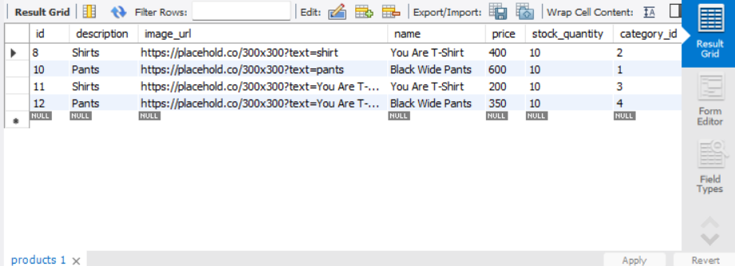
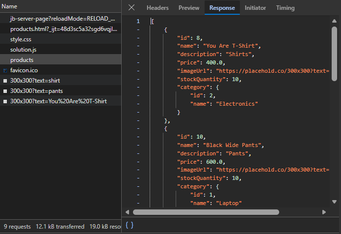
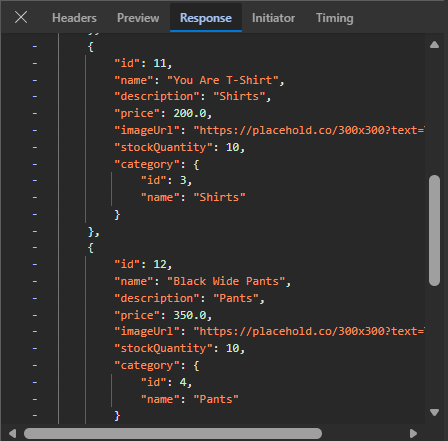

## Frontend

The frontend for this laboratory is available at:
https://github.com/gumataygiancarlos15/ecommerce-interface-lab.git

# Ecommerce API

A RESTful API for managing products built with Spring Boot.

## Features
- Get all products
- Get product by ID
- Create new product
- Update product
- Partial update (Patch)
- Delete product
- Filter by category, name, or price
- Input validation
- Global error handling
- Database persistence with MySQL and Spring Data JPA

## Technologies
- Java 21
- Spring Boot
- Spring Data JPA
- MySQL
- Lombok
- Validation

## Database Schema

### Tables and Relationships

**categories**
- `id` (PK, auto-increment)
- `name` (unique, not null)
- One Category → Many Products

**products**
- `id` (PK, auto-increment)
- `name` (not null)
- `description`
- `price` (not null)
- `image_url`
- `stock_quantity` (not null)
- `category_id` (FK → categories.id)
- Many Products → One Category
- One Product → Many OrderItems

**orders**
- `id` (PK, auto-increment)
- `customer_name` (not null)
- `order_date`
- One Order → Many OrderItems

**order_items**
- `id` (PK, auto-increment)
- `quantity` (not null)
- `unit_price` (not null)
- `order_id` (FK → orders.id)
- `product_id` (FK → products.id)

## API Endpoints

| Method | URL                        | Description        |
|:-------|:---------------------------|:-------------------|
| GET    | /api/v1/products           | Get all products   |
| GET    | /api/v1/products/{id}      | Get product by ID  |
| POST   | /api/v1/products           | Create new product |
| PUT    | /api/v1/products/{id}      | Update product     |
| PATCH  | /api/v1/products/{id}      | Partial update     |
| DELETE | /api/v1/products/{id}      | Delete product     |
| GET    | /api/v1/products/filter    | Filter products    |
| GET    | /api/v1/categories         | Get all categories |
| POST   | /api/v1/categories         | Create a category  |

## Security Architecture

This application uses **Session-Based Authentication** with Spring Security.

### How it works:
1. User submits username and password to `POST /login`
2. Spring Security validates credentials against the database
3. On success, the server creates a session and sends a `JSESSIONID` cookie to the browser
4. The browser automatically sends the `JSESSIONID` cookie with every subsequent request
5. The server validates the cookie to identify the user
6. On `POST /logout`, the session is invalidated and the cookie is deleted

### Why Session-Based?
- The server holds the session state
- Secure against token theft since the session can be invalidated server-side
- CSRF protection is enabled for form submissions

## Validation Rules

| Entity | Field | Constraint |
|--------|-------|------------|
| Product | name | Not blank, min 2 characters |
| Product | price | Must be positive |
| Product | stockQuantity | Cannot be negative |
| User | username | Not blank |
| User | password | Not blank |
| User | role | Not blank |

## API Reference

| Method | Endpoint | Auth Required | Description |
|--------|----------|---------------|-------------|
| GET | /api/v1/products | None | Get all products |
| GET | /api/v1/products/{id} | None | Get product by ID |
| POST | /api/v1/products | Authenticated | Create new product |
| PUT | /api/v1/products/{id} | Authenticated | Update product |
| PATCH | /api/v1/products/{id} | Authenticated | Partial update |
| DELETE | /api/v1/products/{id} | Admin only | Delete product |
| GET | /api/v1/products/filter | None | Filter products |
| GET | /api/v1/categories | None | Get all categories |
| POST | /api/v1/categories | None | Create a category |
| POST | /api/v1/auth/register | None | Register new user |
| POST | /login | None | Login |
| POST | /logout | Authenticated | Logout |

## Screenshots

### Database Table

### Browser Console

## Author
Gumatay, Estrada, Gallano